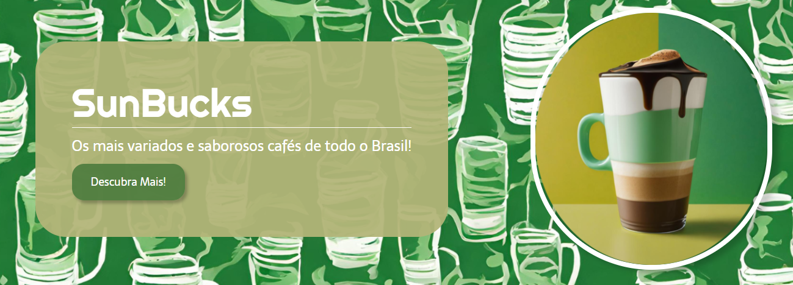
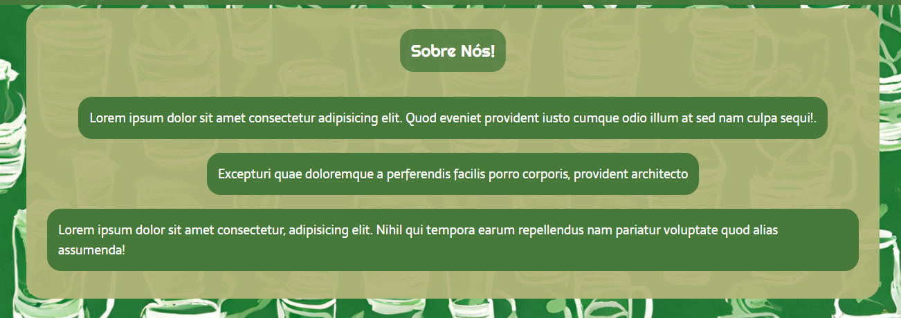
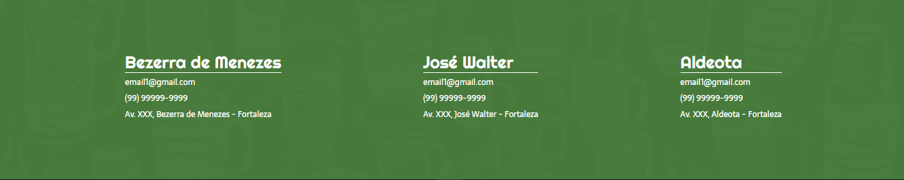

# ☕| SunBucks

 <p> Um site feito para uma empresa fictícia de café chamada SunBucks. </b></p>

## Indice
- [Funcionaldiade do projeto](#Funcionalidade-do-projeto)
- [UI](#UI)
- [Executar projeto](#Como-rodar)
- [Tecnologias utilizadas](#Tecnologias-utilizadas)
- [Autor](#Autor)
- [Atualizações Futuras](#Atualizações-futuras)

## Funcionalidade do projeto

- [x] Exibir uma interface de um site de café

## UI
<div align = "center">
    
    
    
    
</div>

<br>

## Como rodar o projeto

```bash
# Clone este repositório
$ git clone https://github.com/jefolidev/SunBucksLandingPage.git

# Acesse a pasta do proejeto no terminal
# cd todolist-financeiro

# Instale todas dependências
$ npm insall

# Execute a aplicação
```

## Tecnologias utilizadas 
<div align = center>

</div>

## Autor
<div align = center>
 
 <p> <b> Jeferson Franco, Desenvolvedor Full Stack </b> </p> 
 <a style = "text-decoration: none;" href = "https://github.com/jefolidev">  </a>
 <a style = "text-decoration: none;" href = "https://www.linkedin.com/in/jeferson-franco-1349062b0/">  </a>
</div>


## Atualizações futuras
- Nenhuma melhoria futura para esse projeto.
